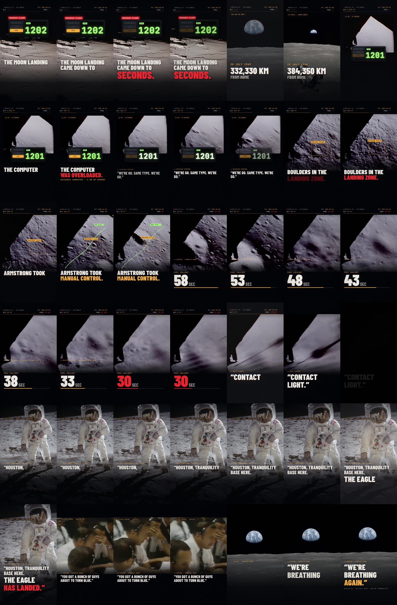

# THE EAGLE HAS LANDED: TikTok-Clip (21 s, 9:16)

Clip 2 der Reihe. Er folgt denselben Viralitätsregeln wie [`../letzte-runde`](../letzte-runde) (siehe
[RESEARCH.md](../letzte-runde/RESEARCH.md)). Diesmal geht es um einen Moment, zu dem Menschen weltweit
einen starken emotionalen Bezug haben: die **Landung von Apollo 11 am 20. Juli 1969**.

Der Clip kombiniert **echtes NASA-Footage, echte Fotos und den Original-Funkverkehr** mit
Motion Graphics, die in **[HyperFrames](https://github.com/heygen-com/hyperframes)** (HTML + GSAP)
gebaut und gerendert sind.

**Ergebnis:** [`output/eagle-has-landed_tiktok.mp4`](output/eagle-has-landed_tiktok.mp4)
1080 × 1920 · 30 fps · 21,0 s · H.264 High · AAC 192 kbit/s · −14 LUFS



## Warum dieses Thema

- **Emotionale Fallhöhe:** Die Landung stand auf Messers Schneide. Der Bordcomputer meldete
  Überlast (Alarme 1202 und 1201), im Landegebiet lagen Felsbrocken, und Armstrong übernahm die
  Steuerung. Danach liefen die Treibstoff-Callouts „60 seconds" und „30 seconds", und 9 Sekunden
  später kam „Contact light".
- **Rechtlich sauber:** Material der NASA ist gemeinfrei. Bekannte Sportmomente (NBA, FIFA …)
  gehören dagegen Ligen und Sendern und lassen sich nicht legal verwenden.
- **Echte Stimmen:** Die Zitate im Clip sind keine Nachvertonung, sondern der Original-Funk von
  Armstrong, Aldrin und CapCom Charlie Duke.

## Aufbau: so viel wie möglich in den ersten Sekunden

| Zeit | Szene | Bild | Ton |
|---|---|---|---|
| **0,00** | **Hook** | Frame 0 zeigt sofort alles: einen roten **PROGRAM ALARM**-Chip, das DSKY-Panel mit **1202**, die Headline „THE MOON LANDING / CAME DOWN TO / **SECONDS.**", die rasende Missionsuhr (MET) und eine Kamerafahrt auf die Mondoberfläche mit roten Alarmpulsen | Original: „1202 program alarm", Master-Alarm-Töne, Sub-Hit |
| 1,79 | Montage | 6 Cuts im Halbtakt (Saturn V, Crew, Erde, Mission Control, LM Eagle, Fußabdruck), „20 JULY 1969", Zähler **0 → 384,400 KM** | „You're go for landing", Quindar-Töne |
| 3,02 | Alarm | 16-mm-Fenster-Footage, DSKY **1201**, „THE COMPUTER WAS OVERLOADED.", „4 KB OF MEMORY" | „1201" · „We're go. Same type. We're go." |
| 5,80 | Felsbrocken | Zielmarkierung **BOULDER FIELD**, eine grüne Flugbahn zeichnet sich zu **NEW SITE**, „ARMSTRONG TOOK MANUAL CONTROL." | Aldrins Höhen-Callouts |
| 8,32 | Treibstoff | Riesiger Countdown **60 → 30 SEC**, Höhe läuft auf 20 ft | „Sixty seconds" · „Picking up some dust", dann bricht die Musik ab und nur ein Herzschlag bleibt |
| 12,40 | Kontakt | Schatten der Kontaktsonde im Staub, „**CONTACT LIGHT.**" | Original „Contact light", Impact |
| 13,80 | Landung | Aldrin-Porträt (Hasselblad-Original), Kinetic Captions Wort für Wort | **„Houston, Tranquility Base here. The Eagle has landed."**, der Orchester-Swell setzt exakt auf „The Eagle" ein |
| 17,85 | Erleichterung | Gesichter in Mission Control, danach die Erde über dem Mondhorizont: „**WE'RE BREATHING AGAIN.**" | „You got a bunch of guys about to turn blue. We're breathing again." |

### Wie das auf die KPIs einzahlt

- **Hook-Rate:** Die Kernbotschaft steht in Frame 0. In den ersten 3 Sekunden gibt es rund
  15 visuelle Ereignisse (Panel, Alarm, 3 Headline-Slams, 6 Cuts, Zähler, Datum, HUD) plus echten
  Funk und Alarmton. Laut TikToks eigenen Daten bringen 63 % der Top-Videos ihre Kernbotschaft in
  den ersten 3 Sekunden, 40 % nutzen Text-Overlays.
- **Completion:** Der Treibstoff-Countdown ist eine offene Schleife: Man will sehen, was bei 30
  passiert. Zusätzlich hält die laufende Missionsuhr die Spannung, und auf die Stille vor dem
  Kontakt folgt die Auflösung.
- **Watch Time und Untertitel:** Jedes Original-Zitat steht als Kinetic Caption im Bild.
  Untertitel steigern die Completion laut Branchendaten um etwa 32 %.
- **Shares und Kommentare:** Der Clip endet auf einem emotionalen, teilbaren Satz („We're
  breathing again."). Hinzu kommen Fakten, die Kommentare auslösen, etwa das Fototag „BUZZ
  ALDRIN · PHOTO: NEIL ARMSTRONG". Viele halten den Astronauten auf dem berühmten Foto für
  Armstrong.

## Faktencheck

Alle Zeiten und Werte stammen aus dem [Apollo Lunar Surface Journal](https://apollojournals.org/alsj/a11/a11.landing.html):

| Missionszeit (MET) | Ereignis |
|---|---|
| 102:38:26 | Alarm 1202 |
| 102:42:19 | Alarm 1201 bei rund 3000 ft |
| 102:44:00 | Treibstoff 8 % |
| 102:44:45 | Treibstoff 5 % |
| 102:45:02 | „60 seconds" |
| 102:45:31 | „30 seconds" |
| 102:45:40 | „Contact light" |
| 102:45:58 | „The Eagle has landed" |

Das HUD zeigt die echte Missionszeit und interpoliert die Höhe zwischen Aldrins Callouts.

Bewusst weggelassen habe ich drei Dinge:

- **Die Zahl „600–650 Millionen Zuschauer".** Sie bezieht sich auf den ersten Schritt, also
  6,5 Stunden *nach* der Landung.
- **Ein „30 seconds" als Untertitel auf echtem Ton.** Im NASA-Film ist der Callout von Aldrins
  „drifting to the right" überlagert und nicht verlässlich hörbar. Er steht daher nur als
  HUD-Grafik im Bild.
- **„Sie hatten nur 30 Sekunden Treibstoff".** Laut Nachanalyse blieben etwa 45 Sekunden, weil der
  Füllstandssensor wegen schwappenden Treibstoffs zu früh auslöste. Der Clip zitiert nur den
  Callout selbst.

Die Zeitstempel der Original-Zitate habe ich mit `faster-whisper medium.en` wortgenau gemessen (siehe `prep.py`).

## Technik

```
fetch_assets.sh  NASA-Film HQ-194 (1969), B-Roll, Funk-Audio, Hasselblad-Fotos, Mixkit-Musik/SFX, Fonts
prep.py          Inverse Telecine (fieldmatch+decimate) → 23,976p-Filmframes, quadratische Pixel,
                 Entrauschen, Zuschnitt, Lanczos-Upscale, Speed baked-in; Foto-Crops; Wort-genaue Audio-Schnitte
hf/index.html    HyperFrames-Komposition: Szenen, HUD (MET/ALT/FUEL), DSKY-Panel, Zielmarkierung,
                 SVG-Flugbahn, Zähler, Kinetic Captions – eine pausierte GSAP-Timeline, deterministisch
audio.py         Funk (Bandpass-Färbung, Pegelangleich), Quindar-Töne 2525/2475 Hz, Master-Alarm,
                 Spannungs-Score mit Ducking + harter Cut, Orchester-Swell, Limiter, 2-Pass-Loudnorm −14 LUFS
post.py          Finishing über den HyperFrames-Render: Impact-Shake, Weißblitze, chromatische
                 Aberration, Bloom, luminanzabhängiges Filmkorn; Mux
make.sh          alles in einem Rutsch
```

Neu bauen (benötigt Node ≥ 22, FFmpeg, Python mit `numpy opencv-python-headless pillow scipy soundfile`):

```bash
./make.sh
# Vorschau einzelner Zeitpunkte:
cd hf && npx hyperframes snapshot --at 0.05,3.5,11.7,17.6
```

## Credits & Lizenzen

- **NASA:** Film HQ-194 (National Archives 255-HQ-194), Apollo 11 B-Roll, Funk-Audio und die
  Fotos AS11-37-5437, AS11-40-5903, AS11-40-5878, AS11-44-6552, AS11-44-6642 sowie 69-01000.
  Alles gemeinfrei (US-Regierungswerke). Der Clip impliziert keine Billigung durch die NASA und
  verwendet keine NASA-Logos.
- **Musik:** Mixkit #464 „Sci-Fi Score" und #587 „Discover"
  ([Mixkit License](https://mixkit.co/license/)). SFX von Mixkit.
- **GSAP 3.14.2** (lokal unter `hf/vendor/`), [GSAP Standard License](https://gsap.com/standard-license).
- **Fonts:** Barlow Condensed und JetBrains Mono (SIL Open Font License).
