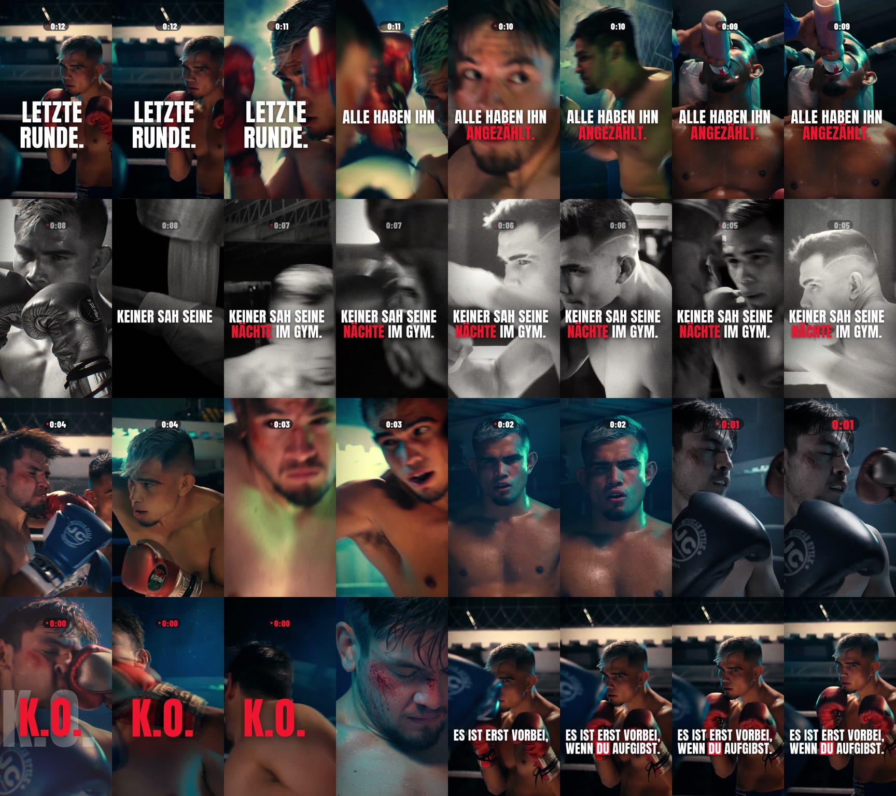

# LETZTE RUNDE / FINAL ROUND: TikTok-Sport-Clip (16 s, 9:16)

Ein Boxing-Edit, gebaut auf die Werte aus [RESEARCH.md](RESEARCH.md): Hook-Rate, Completion,
Rewatch und Shares. Die Texte im Video sind auf Englisch. Alles ist programmatisch erzeugt: Die Schnittliste ist Code, Speed-Ramps,
Grading, Typo und Sounddesign rechnet eine eigene Python/OpenCV-Engine. Das Ergebnis lässt sich
damit exakt reproduzieren.

**Ergebnis:** [`output/letzte-runde_tiktok.mp4`](output/letzte-runde_tiktok.mp4)
1080 × 1920 · 30 fps · 16,0 s · H.264 High ~16 Mbit/s · AAC 192 kbit/s · −13,9 LUFS



## Story in 16 Sekunden

| Zeit | Akt | Bild | Text | Sound |
|---|---|---|---|---|
| 0,0 | **Hook** | Der Sieger schaut in die Linse, bei 1,0 s fliegt ein Schlag in die Kamera | **FINAL ROUND.** + Uhr **0:12** | 808 auf Frame 0, Whoosh, Impact |
| 1,0 | Druck | Er kassiert Treffer (blauer Handschuh exakt auf dem 808 bei 1,5 s), Gegner, Ecke mit Wasser | THEY COUNTED HIM **OUT.** | Punches, Atem |
| 4,0 | Erinnerung | S/W-Flashback, ein Schnitt pro Beat: Pads, Bandagen, Sandsack, Schattenboxen | NOBODY SAW HIS **NIGHTS** IN THE GYM. (eine Zeile pro Beat) | Tape-Rewind, Musik per Tiefpass „wie erinnert" |
| 8,0 | Comeback | Zurück in Farbe: sein Schlag landet (Slow-Mo mit Schweiß-Spray), die Schnitte werden schneller | – | Treffer auf jedem Cut |
| 10,0 | Der Blick | Kopf hebt sich, Blick in die Kamera, langsamer Push-in | – | Whoosh |
| 11,1 | Stille | Musik bricht ab, der Handschuh fliegt in 0,3× an, Uhr pulsiert rot **0:01** | – | nur Herzschlag + Atem |
| 12,0 | **K.O.** | Treffer exakt auf dem Drop: Weißblitz, Shake, Speed-Ramp 1× → 3,5×, die Kamera folgt dem Fall | **K.O.** · Uhr **0:00** | Impact-Stack, Ringglocke, Crowd |
| 13,5 | Danach | Der Gegner blutend in der Ecke | – | Crowd |
| 14,0 | Botschaft | Der Sieger in Deckung, Blick in die Kamera | IT'S NOT OVER UNTIL **[YOU]** QUIT. | – |
| 16,0 | **Loop** | Der letzte Frame geht nahtlos in Frame 0 über | – | Musik taktgenau geloopt |

Musik: „Sparta" (Mixkit #370), 120 BPM, Ausschnitt 0:36–0:52. Die Beat-Map wurde mit librosa gemessen:
808-Hits liegen bei 0 / 1,5 / 4 / 4,76 / 5,5 / 8 / 9,5 / **12,0** s, Snares auf jeder ungeraden Sekunde.
Der Track hat bei 11,1–11,95 s selbst einen Drop-out. Genau dort sitzt der Freeze vor dem K.O.

## Bildsprache & Editing-Techniken

- **Speed-Ramps mit PCHIP-Zeitkurven:** Beschleunigung und Abbremsung laufen weich statt linear.
  Für Slow-Mo rechnen **DIS-Optical-Flow-Zwischenbilder** fehlende Frames. Bei Speed-ups sorgt eine
  **Shutter-Akkumulation** für echte Bewegungsunschärfe.
- **Natives Slow-Mo-Material** (der K.O.-Clip ist hochfrequent gedreht): Bis zum Treffer läuft es in 1×,
  danach wird auf 3,5× hochgerampt.
- **4K-Quellen**, auf 9:16 zugeschnitten und vorskaliert, damit Zooms ohne doppeltes Resampling auskommen.
  Beim K.O. wird **breiter dekodiert**, sodass die Kamera dem Fall per Pan folgen kann.
- **Impact-System:** Shake, Zoom-Punch, Weißblitz, Chromatic Split und Glitch klingen auf jedem
  Treffer exponentiell ab.
- **Grading:** Schwarzpunkt, filmische S-Kurve, Teal-Schatten und warme Highlights, Bloom bzw. Halation,
  Vignette, feines luminanzabhängiges Filmkorn. Der Flashback läuft als Silber-S/W mit Gate-Weave und Flicker.
- **Typo:** Anton in Versalien, Slam-in mit Motion-Blur, ein Akzent in Rot, „YOU" in einer roten Box.
  Ein weicher Scrim sichert die Lesbarkeit. Alles liegt in TikToks Safe Zone, also frei von der Like-Leiste
  rechts und der Caption unten.
- **Round-Clock-HUD** als Retention-Mechanik: 0:12 → 0:00, Tick pro Sekunde, pulsiert im Herzschlag.
- **Sounddesign:** Die Transienten jedes SFX werden automatisch auf den Schnitt ausgerichtet. Die Ringglocke
  ist synthetisiert, die Crowd-Bed endet vor der Stille. Zum Schluss folgen Look-ahead-Limiter und
  2-Pass-Loudnorm (linear) auf −14 LUFS / −1 dBTP.

## Neu bauen

```bash
pip install numpy opencv-python-headless pillow scipy soundfile librosa
./make.sh          # lädt Assets (falls nötig), rendert Ton + Bild, muxt, erzeugt Cover & Contact Sheet
```

Einzelne Frames zur Kontrolle: `python3 render.py --frames 0,360,470` (schreibt `output/still_###.png`).

| Datei | Inhalt |
|---|---|
| `edl.py` | Die komplette Schnittliste: Shots mit Zeitkurven und Crops, Impacts, Texte, HUD, SFX-Cues |
| `engine.py` | Dekodierung, Optical-Flow-Sampling, Geometrie, Grading, Typo, Encoder |
| `render.py` | Frame-Loop: Bild, Effekte, Text und HUD → ffmpeg-Pipe |
| `audio.py` | Musik-Schnitt, Tiefpass-Flashback, SFX-Platzierung, Glocke, Limiter, Loudnorm |
| `fetch_assets.sh` | Lädt alle Quellen (nicht im Repo eingecheckt) |
| `RESEARCH.md` | Metriken, Benchmarks und Quellen |

## Credits & Lizenzen

- Footage, Musik und SFX: [Mixkit](https://mixkit.co/license/), kostenlos nutzbar ohne Attributionspflicht.
  Clips: 4596, 40255, 40265, 40266, 40948, 40955, 40958, 40961, 40963, 40964, 40966, 40969, 40970, 40971, 40973, 40974.
  Musik: #370 „Sparta". SFX-IDs stehen in `fetch_assets.sh`.
- Fonts: Anton und Barlow Condensed ([SIL Open Font License](https://openfontlicense.org)).
